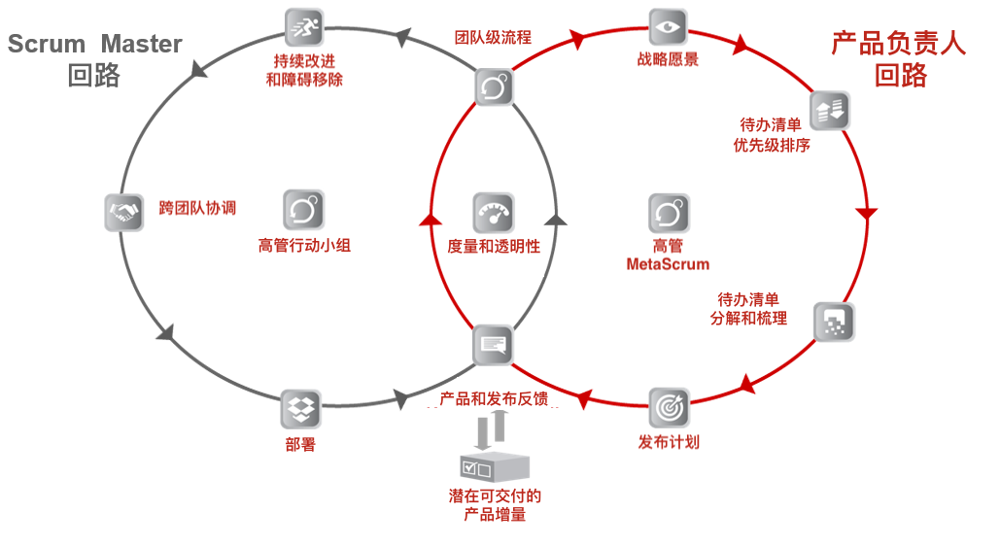
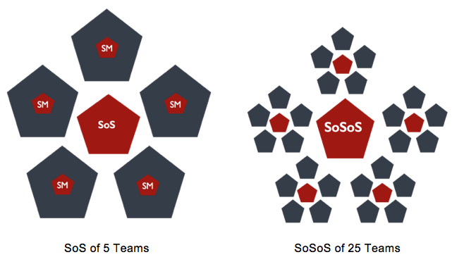
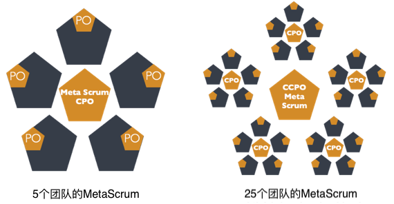
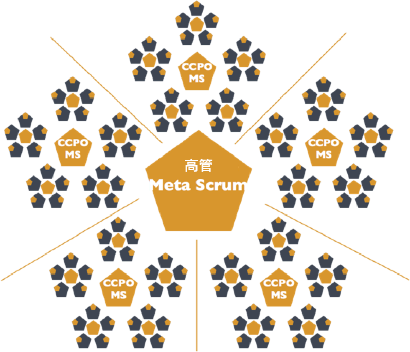
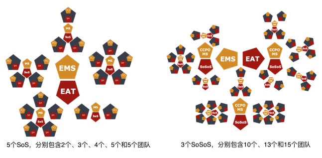
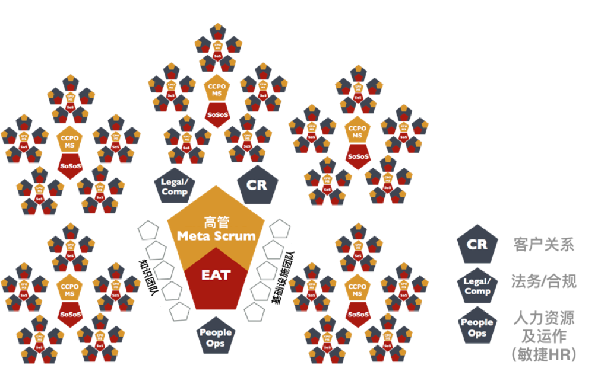

The Scrum At Scale® Guide 
-------------------------

Scrum At Scale® - 规模化Scrum指南
--------------------------------

Copyright © 2006-2018 Jeff Sutherland and Scrum Inc., All Rights Reserved
Scrum@Scale is a registered trademark of Scrum Inc.
This guide is released under Creative Commons 4.0 Attribution-Sharealike License

版权所有© 2006-2018 Jeff Sutherland 及 Scrum Inc. 

Scrum@Scale是Scrum Inc.的注册商标。本指南基于"署名-相同方式共享许可协议4.0"发布。(CC BY-SA 4.0)

简体中文版原创翻译团队：申健 Jacky Shen (CST, CTC, Agile Coach); 王洪亮 Stephen Wang (CSP, Agile Coach); 李国彪 Bill Li (CST, Agile Coach);

简体中文版授权译文链接：<http://www.uperform.cn/scrum-at-scale-guide-chinese/>，欢迎转载，请保留所有版权信息并遵循共享许可协议进行演绎。

# Purpose of the Scrum@Scale Guide
# Scrum@Scale指南之目的

Scrum, as originally outlined in the Scrum Guide, is a framework for developing, delivering, and sustaining complex products by a single team. Since its inception, its usage has extended to the creation of products, processes, services, and systems that require the efforts of multiple teams. Scrum@Scale was created to efficiently coordinate this new ecosystem of teams in a way that optimizes the overall strategy of the organization. It achieves this goal through setting up a “minimum viable bureaucracy” via a scale-free architecture, which naturally extends the way a single Scrum team functions across the organization.

最初在Scrum指南中描述的Scrum，是单个团队进行开发、交付和持续发展复杂产品的框架。自诞生以来，它已经扩展到需要多个团队合作来创建产品、处理过程、服务和系统。创建Scrum@Scale是为了有效地整合这种新型的团队生态系统，从而优化组织的整体策略。为了实现这个目标，它利用一个自由扩展的架构建立起一个“最小可行的官僚机构”，自然地将单个Scrum团队的功能扩展到整个组织中。

This guide contains the definitions of the components that make up the Scrum@Scale framework, including its scaled roles, scaled events, and enterprise artifacts, as well as the rules that bind them together.

本指南包括构成Scrum@Scale框架的组件定义，包括扩展的角色、扩展的事件、企业级工件，以及将它们组织在一起的各种规则。

Dr. Jeff Sutherland developed Scrum@Scale based on the fundamental principles behind Scrum, Complex Adaptive Systems theory, game theory, and object-oriented technology. This guide was developed with the input of many experienced Scrum practitioners based on the results of their field work. The goal of this guide is for the reader to be able to implement Scrum@Scale on their own.

Jeff Sutherland博士基于Scrum、复杂自适应系统理论、博弈论、面向对象技术等背后的基础原则开发了Scrum@Scale。本指南采纳了许多有经验的Scrum实践者的输入，基于他们的现场工作成果。本指南之目标是读者能够自行实施Scrum@Scale。

## Why Scrum@Scale?
## 为什么要Scrum@Scale?

Scrum was designed for a single team to be able to work at its optimal capacity while maintaining a sustainable pace. In the field, it was found that as the number of Scrum teams within an organization grew, the optimal output (working product) and velocity of those teams began to fall (due to issues like cross-team dependencies and duplication of work). It became obvious that a framework for effectively coordinating those teams was needed in order to achieve linear scalability. Scrum@Scale is designed to accomplish this goal via its scale-free architecture.

Scrum是为单个团队而设计，使其能够在可持续的速率下发挥最佳生产力。在该领域中，人们发现随着组织内的Scrum团队数量增长，最佳输出（可工作的产品）及那些团队的速率会开始下降（比如由于跨团队依赖和重复劳动等问题）。很明显，为了获得线性的可扩展性，人们需要一个有效整合那些团队的框架。设计Scrum@Scale是为了利用自由扩展的架构达成这个目标。

By utilizing a scale-free architecture, the organization is not constrained to grow in a particular way determined by a set of arbitrary rules; rather it can grow organically based on its unique needs and at a sustainable pace of change that can be accepted by the groups of individuals that make up the organization.

通过使用无标度架构，组织的增长并不受限于以一组武断规则所决定的特定方式；相反，它可以有机地基于自己的独特需求而增长，并维持可持续的变革速度，从而可以被组织的成员们接受。

Scrum@Scale is designed to scale across the organization as a whole: all departments, products and services. It can be applied across multiple domains in all types of organizations in industry, government, or academia.

Scrum@Scale是为组织的整体扩展而设计：所有部门、产品和服务。它可以被运用到不同领域，包括工商业、政府或学术界中的各类组织。

## Definition of Scrum@Scale
## Scrum@Scale的定义

Scrum (n): A framework within which people can address complex adaptive problems, while productively and creatively delivering products of the highest possible value.

Scrum（名词）：Scrum是一个框架，在此框架中，人们可以解决复杂自适应问题，同时高效并创造性地交付最大价值的产品。

The Scrum Guide is the minimal feature set that allows inspection and adaptability via radical transparency to drive innovation, performance, and team happiness.

Scrum指南是最小功能的集合，它通过彻底的透明性促进检视和适应性，从而驱动创新、绩效和团队幸福感。

Scrum@Scale (n): A framework within which networks of Scrum teams operating consistently with the Scrum Guide can address complex adaptive problems, while creatively delivering products of the highest possible value.

Scrum@Scale（名词）：Scrum@Scale是一个框架，在此框架中，一致采用Scrum指南进行运作的Scrum团队网络可以解决复杂自适应问题，同时高效并创造性地交付最大价值的产品。

**NOTE:** These “products” may be hardware, software, complex integrated systems, processes, services, etc., depending upon the domain of the Scrum teams.

**注意：** 这些“产品”可以是硬件、软件、复杂的集成系统、处理过程、服务等，取决于Scrum团队所处的领域。

Scrum@Scale is:
* Lightweight – the minimum viable bureaucracy
* Simple to understand – consists of only Scrum teams
* Difficult to master – requires implementing a new operating model

Scrum@Scale是:
* 轻量的 - 最小可行的官僚机构
* 易于理解的 - 仅仅包含Scrum团队们
* 难以精通的 - 需要实施一个全新的运作模型

Scrum@Scale is a framework for scaling Scrum. It radically simplifies scaling by using Scrum to scale Scrum. It consists only of Scrum teams coordinated via Scrum of Scrums and MetaScrums.

Scrum@Scale是一个对Scrum进行扩展的框架。通过使用Scrum来扩展Scrum，它彻底简化了规模扩展。它仅仅包含一些Scrum团队，这些团队通过Scrum of Scrums和MetaScrums进行整合。

The component-based nature of Scrum@Scale allows an organization to customize their transformational strategy and implementation. It gives them the ability to target their transformation efforts in the area(s) they deem most valuable or most in need of change and then progress on to others.

Scrum@Scale本身基于组件的性质允许组织定制他们的转型策略和实现方式。它使得他们获得一种能力，可以将转型的努力聚焦在他们认为最有价值或最需要改变的领域内，然后再向其他方面取得进展。

In Scrum, care is taken to separate accountability of the “what” from the “how”. The same care is taken in Scrum@Scale so that jurisdiction and accountability are expressly understood in order to eliminate wasteful organizational conflict that keep teams from achieving their optimal productivity.

在Scrum中，要注意区分对“What”与“How”的问责。在Scrum@Scale中也是一样，那么就要明确地理解权限和职责，从而消除浪费性的组织冲突，令团队更容易达致最佳生产力。

In separating these two jurisdictions, Scrum@Scale contains two cycles: the Scrum Master Cycle (the “how”) and the Product Owner Cycle (the “what”), each touching the other at two points. Taken together, these cycles produce a powerful framework for coordinating the efforts of multiple teams along a single path.

为了区分这两个权限，Scrum@Scale包含两个回路：Scrum Master回路（“How”）和产品负责人回路（“What”），彼此具有两个相互接触点。总之，这些回路造就了一个强大的框架，整合多个团队朝着同一个方向而努力。

## The Components of the Scrum@Scale Framework
## Scrum@Scale框架的组件

Scrum Master Cycle
Executive Action Team
Continuous Improvement & Impediment Removal
Cross-Team Coordination
Deployment
Product & Release Feedback
Potentially Shippable Product Increment
Metrics & Transparency
Team-Level Process
Product Owner Cycle
Executive Meta Scrum
Strategic Vision
Backlog Prioritization
Backlog Decomposition & Refinement
Release Planning

Scrum Master回路
高管行动小组
持续改进与移除障碍
跨团队整合
部署
产品与发布的反馈
潜在可交付的产品增量
度量与透明性
团队级过程
产品负责人回路
高管MetaScrum
战略愿景
待办清单排序
待办清单分解和梳理
编制发布计划

## Values-Driven Culture
## 价值观驱动的文化

Besides separating accountability of the “what” and the “how”, Scrum@Scale further aims to build healthy organizations by creating a values-driven culture in an empirical setting. The Scrum values are: Openness, Courage, Focus, Respect, and Commitment. These values drive empirical decision making, which depend on the three pillars of transparency, inspection, and adaptation.

除了区分对“What”与“How”的问责，Scrum@Scale还进一步在实证背景下创造价值驱动的文化，旨在建立健康的组织。Scrum的价值观包括：开放、勇气、专注、尊重和承诺。这些价值观驱动着实验性决策，而其取决于透明、检视和调整这三大支柱。

Openness supports transparency into all of the work and processes, without which there is no ability to inspect them honestly and attempt to adapt them for the better. Courage refers to taking the bold leaps required to deliver value quicker in innovative ways.

开放支持着所有工作和过程的透明性，没有这种透明度，就无法诚实地检视并试图更好地调整它们。勇气指的是大胆跳跃，这是以创新方式更快地交付价值所需要的。

Focus and Commitment refer to the way we handle our work obligations, putting customer value delivery as the highest priority. Lastly, all of this must occur in an environment based on respect for the individuals doing the work, without whom nothing can be created.

专注和承诺是我们处理工作职责的方式，把交付客户价值作为最高优先级。最后，所有这一切都必须发生在一个尊重每个人的工作环境中，否则不可能创造任何东西。

Scrum@Scale helps organizations thrive by supporting both a servant-leadership and intent-based leadership model,[^1] which fosters a positive environment for working at a sustainable pace and putting commitment to deliver customer-facing value at the forefront of our efforts.

Scrum@Scale支持仆人式领导风格和基于意图的领导力模型，以帮助组织蓬勃发展，[^1]培养一个以可持续速率进行工作的积极环境，致力于将面向客户价值放在努力的第一位。

## Getting Started with Scrum@Scale
## 开始使用Scrum@Scale

When implementing large networks of teams, it is critical to develop a scalable Reference Model for a small set of teams. Any deficiencies in a Scrum implementation will be magnified when multiple teams are deployed.

在实施大型团队网络时，针对少量团队开发出一个可扩展的参考模型是至关重要的。当部署多个团队时，Scrum实施中的任何缺陷都会被放大。

Therefore, the first challenge is to create a small set of teams that implements Scrum well. This set of teams works through organizational issues that block agility and creates a Reference Model for Scrum that is known to work in the organization and can be used as a pattern for scaling Scrum across the organization.

因此，第一个挑战就是建立少量良好实施Scrum的团队。这组团队克服了那些阻碍敏捷性的组织问题，并为Scrum创建一个在组织中众所周知可运行的参考模型，将其用作整个组织范围内扩展Scrum的模式。

As the Reference Model of teams accelerates, impediments and bottlenecks that delay delivery, produce waste, or impede business agility become apparent. The most effective way to eliminate these problems is to spread Scrum across the organization so that the entire value stream is optimized.

随着团队参考模型的加速，延迟交付、产生浪费或妨碍业务敏捷性的障碍及瓶颈会变得明显。消除这些问题的最有效方法是在整个组织中传播Scrum，以便优化整个价值流。

Scrum@Scale achieves linear scaling in productivity by saturating the organization with Scrum and distributing velocity and quality organically, consistent with the organization’s specific strategy, product, and services.

Scrum@Scale通过使组织浸泡在Scrum中，并有机地分配速度和质量，从而实现了生产力的线性扩展，与组织的特定策略、产品和服务保持一致。

# Scrum Master Cycle
# Scrum Master回路

## Team-Level Process
## 团队级过程

The **Team-Level Process** is laid out clearly in the Scrum Guide. It is composed of three artifacts, five events, and three roles. The goals of the team level process are to:

在Scrum指南中明确阐述了**团队级过程**。它由三个工件、五个事件和三个角色组成。团队级过程旨在：

* maximize the flow of completed and quality tested work.
* increase velocity a little each Sprint.
* operate in a way that is sustainable and enriching for the team.

* 最大限度地使完成和通过质量验证的工作流动起来。
* 每个Sprint都提高一点点速率。
* 以一种可持续和丰富的方式运作。

## Coordinating the “How” – The Scrum of Scrums
## 整合如何做事(“How”) - Scrum of Scrums

A set of the teams that have a need to coordinate comprise a **“Scrum of Scrums” (SoS)**. The SoS is a “team of teams,” [^2] which hold a **Scaled Daily Scrum (SDS)** event with a representative from each team (usually the team’s Scrum Master, although any person or number of people may attend). The SDS exists to coordinate teams and remove impediments to delivering value.

需要协作的多个团队组成一个**“Scrum of Scrums”（SoS）** 。SoS是“团队的团队”[^2]，每天举行一个**规模化每日例会（SDS）**事件，每个团队派代表参加（通常是团队的Scrum Master，尽管任何人都可以参加，也可以派多个人参加）。SDS的存在是为了协调团队并移除障碍以交付价值。

The SDS event mirrors the Daily Scrum in that it optimizes the collaboration and performance of the network of teams. Additionally, the SDS:

SDS事件反映了每日Scrum例会，优化了团队网络的协作和绩效。另外，SDS：

* is time-boxed to 15 minutes or less.
* must be attended by a representative of each team.
* is a forum where team representatives address 3 simple questions:
    * What impediments does my team have that will prevent them from accomplishing their Sprint Goal (or impact the upcoming release)?
    * Is my team doing anything that will prevent another team from accomplishing their Sprint Goal (or impact their upcoming release)?
    * Have we discovered any new dependencies between the teams or discovered a way to resolve an existing dependency?

* 少于15分钟的时间盒。
* 每个团队必须派代表参加。
* 是一个团队代表们解决3个简单问题的论坛：
	* 我的团队有什么障碍阻止了他们完成他们的Sprint目标（或影响即将发布的版本）？
	* 我的团队是否在做任何事情阻止了其他团队完成他们的Sprint目标（或影响他们即将发布的版本）？
	* 我们发现了团队之间的任何新的依赖关系吗，或者找到了解决现有依赖关系的方法吗？

This team of Scrum Masters is a Scrum Team unto itself which is responsible for a fully integrated set of potentially shippable increments of product at the end of every Sprint from all participating teams. The SoS team needs to be responsive in real-time to impediments raised by participating teams.

这一组Scrum Master们本身就是一个Scrum团队，负责在每个Sprint末尾从所有参与团队那里完全地集成出一个潜在可交付的产品增量。SoS团队需要实时地应对所有参与团队所提出的障碍。

A SoS functions as a Release Team and must be able to directly deliver value to customers. To do so effectively, it needs to be consistent with the Scrum Guide; that is, have its own roles, artifacts, and events. This includes a Backlog Refinement event wherein they decide what impediments are “ready” to be removed, how best to remove them, and how the team will know it is “done.” Particular attention should be paid to the SoS Retrospective in which the teams’ representatives share any learnings or process improvements that their individual teams have succeeded with, in order to standardize those practices across the teams within the SoS.

SoS充当一个发布团队，必须能够直接地向客户交付价值。为了能有效地做到这一点，它需要与Scrum指南保持一致；也就是说，要有自己的角色，工件和事件。这包括一个待办清单梳理事件，他们在其中决定哪些障碍已经“准备好”被移除，最佳移除障碍的方式是怎样的，团队如何才能知道它是“完成”的。要特别关注SoS回顾事件，团队代表们在其中分享各自团队中的任何成功的学习收获或流程改进，以便在SoS中的各个团队能够将这些实践标准化下来。

It needs to have all of the skills necessary to deliver a fully integrated potentially shippable product at the end of every Sprint. It has Product Owner representation to resolve prioritization issues. It may need experienced architects, QA Leaders, and other operational skill sets. When starting Scrum@Scale the teams may not have an infrastructure that supports continuous deployment. This may force the SoS to set up an “integration team” or “release team” that generates the extra work required to overcome engineering deficiencies. The SoS is encouraged to address impediments to integration and deployment aggressively as it creates an environment for hyper-productivity, e.g. Amazon has 3300 Scrum teams deploying on average more than once per second[^3].

为了在每个Sprint结束时交付一个完全集成的潜在可交付产品，它需要具备所需的所有技能。它具有产品负责人代表来解决优先级问题。它可能需要经验丰富的架构师，QA负责人和其他操作技能组。当启动Scrum@Scale时，团队们可能还不具备能够支持持续部署的基础架构。这会迫使SoS建立一个“集成团队”或“发布团队”，以完成克服工程缺陷所需的额外工作。SoS被鼓励去激进地解决集成和部署的障碍，因为它创造了一个超高生产力的环境，例如，亚马逊有3300个Scrum团队，平均每秒部署超过一次[^3]。

## The Scrum of Scrums Master (SoSM)
## Scrum of Scrums Master (SoSM)

The Scrum of Scrums Master (SoSM) is accountable for the release of the joint teams’ effort and must:

SoSM负责联合团队的发布，并且必须：

* make an impediment backlog visible to the organization.
* remove impediments that the teams cannot address themselves.
* prioritize the impediments, with particular attention to cross-team dependencies and the distribution of backlog.
* improve the efficacy of the Scrum of Scrums.
* work closely with the Product Owners to deploy a potentially releasable Product Increment at least every Sprint.
* coordinate the teams’ deployment with the Product Owner’s Release Plans.

* 使组织可以看到障碍待办清单。
* 移除团队自己无法解决的障碍。
* 对障碍进行排序，特别要关注跨团队依赖和产品待办清单的分配。
* 提升Scrum of Scrums的效果。
* 与产品负责人们密切合作，每个Sprint部署至少一个潜在可交付的产品增量。
* 利用产品负责人的发布计划来整合多团队的部署工作。

## Scaling the SoS
## 扩展SoS

Depending upon the size of the organization or implementation, more than one SoS may be needed to deliver a very complex product. In those cases, a **Scrum of Scrum of Scrums (SoSoS)** can be created out of multiple Scrums of Scrums. The SoSoS is an organic pattern of Scrum teams which is infinitely scalable. Each SoSoS should have SoSoSM’s and scaled versions of each artifact & event.

根据组织或实施的规模，可能需要多个SoS来交付非常复杂的产品。在那些情况下，可以从多个Scrum的Scrum中创建一个**Scrum of Scrum of Scrums（SoSoS)**。 SoSoS是Scrum团队的一个有机模式，可以无限扩展。每个SoSoS都应该有SoSoSM角色们，以及每个工件和事件的扩展版本。

Scaling the SoS reduces the number of communication pathways within the organization so that complexity is encapsulated. The SoSoS interfaces with a SoS in the exact same manner that an SoS interfaces with a single Scrum team which allows for linear scalability.

扩展SoS减少了组织内部的沟通路径数量，因此复杂性被封装了起来。SoSoS与SoS的接口、SoS与单个Scrum团队的接口，两者都采用了相同的方式，从而实现线性可扩展性。

Sample Diagrams:
示例图：

SoS of 5 Teams
SoSoS of 25 Teams

5个团队的SoS
25个团队的SoSoS

**NOTE:** While the Scrum Guide defines the optimal team size as being 3 to 9 people, Harvard research determined that optimal team size is 4.6 people.[^4] Experiments with high performing Scrum teams have repeatedly shown that 4 or 5 people doing the work is the optimal size. It is essential to linear scalability that this pattern be the same for the number of teams in a SoS. Therefore, in the above and following diagrams, pentagons were chosen to represent a team of 5. These diagrams are meant to be examples only, your organizational diagram may differ greatly.

**注意：** 尽管Scrum指南将最优团队规模定义为3到9人，但哈佛大学的研究认为最优团队规模为4.6人。[^4] 针对高绩效Scrum团队的研究一再表明4或5人在一起工作是最优人数。对于SoS中的团队数量，这种模式带来的线性可扩展性是至关重要的。因此，在上图和下图中，选择了五边形来表示一个5人团队。这些图仅仅是示例，您的组织图表可能会有很大差异。

## The Executive Action Team
## 高管行动小组

The Scrum of Scrums for the entire agile organization is called the Executive Action Team (EAT). The EAT is the final stop for impediments that cannot be removed by the SoS’s that feed it. Therefore, it must be comprised of individuals who are empowered, politically and financially, to remove them. The function of the EAT is to coordinate multiple SoS’s (or SoSoS’s). As with any Scrum team, it needs a PO and SM. It would be best if the EAT met daily as a Scrum team. They must meet at least once per Sprint and have a transparent backlog.

针对整个敏捷组织的Scrum of Scrums被称为高管行动小组（EAT）。EAT是SoS不能移除的那些障碍的终点站。所以，它必须由在政治和财务上得到充分授权的人们组成，去移除那些障碍。EAT的职能是协调多个SoS（或者SoSoS）。和任何Scrum团队一样，它也需要具备一个PO和SM。EAT最好也像Scrum团队一样可以每天见面。每个Sprint他们必须至少见一次面，并且具备一个透明的待办清单。

Sample Diagram showing an EAT coordinating 5 groupings of 25 teams
例图展示了1个EAT，正在协调分布在5个群组中的25个团队

EAT
SoSoS

高管行动小组
SoSoS

## The EAT’s Backlog & Responsibilities
## EAT的待办清单及责任

Scrum is an agile operating system that is different from traditional project management. The entire SM organization reports into the EAT, which is responsible for implementing this agile operating system by establishing, maintaining, and enhancing the implementation in the organization. The EAT’s role is to create an Organizational Transformation Backlog (a prioritized list of the agile initiatives that need to be accomplished) and see that it is carried out. For example, if there is a traditional Product Development Life Cycle in the old organization, a new agile Product Development Life Cycle needs to be created, implemented, and supported. It will typically support quality and compliance issues better than the old method but be implemented in a different way with different rules and guidelines. There are many other aspects of organizational development and governance that may need retuning.

Scrum是一个区别于传统项目管理的敏捷操作系统。整个SM组织汇报给EAT，后者负责在组织内建立、维护和提升其打造的敏捷操作系统。EAT的角色是创建组织转型待办清单（一份经过排序的列表，包含待完成的敏捷举措）并确保落地执行。例如，如果在一个旧组织中存在一个传统的产品开发生命周期，那么一个新的敏捷产品开发生命周期需要被创建、实现和支持。通常它会比旧方法的更好地支持质量和合规事项，但是需要采纳一套不同的规则和指南来实施。另外，组织发展和治理的很多方面也需要调优。

The EAT is accountable for the quality of Scrum within the organization. Its responsibilities include but are not limited to:

EAT对于整个组织的Scrum质量负责。它的职责包括但不仅于：

* creating an agile operating system for the Reference Model as it scales through the organization, including corporate operational rules, procedures, and guidelines to enable agility.
* measuring and improving the quality of Scrum in the organization.
* building capability within the organization for business agility.
* creating a center for continuous learning for Scrum professionals.
* supporting the exploration of new ways of working.

* 为参考模型创建敏捷操作系统，以扩展到整个组织，包括提升敏捷性的企业运营规则，过程和指南。
* 度量和改进组织内的Scrum质量
* 构建组织内业务敏捷的能力
* 创建一个针对Scrum专业人士的持续学习中心
* 支持去探索新型工作方法

Finally, the EAT must set up and support a corresponding Product Owner organization through associations of PO’s that mirror the SoS’s and scale their PO functions. These teams of PO’s and key stakeholders are known as **MetaScrums**.

最后，EAT必须比照SoS，聚集PO群体来建立和支持相应的的产品负责人组织，从而扩展PO职能。这些PO和关键干系人的团队被称为**MetaScrum**。

## Outputs/Outcomes of the Scrum Master Organization
## Scrum Master组织的输出/效果

The SM organization (SoS, SoSoS, and EAT) work as a whole to complete the other components of the Scrum Master Cycle: **Continuous Improvement and Impediment Removal, Cross-Team Coordination, and Deployment.**

SM组织（SoS、SoSoS和EAT）作为一个整体来完成Scrum Master回路的组件：**持续改进和移除障碍，跨团队协调，和部署**

The goals of Continuous Improvement and Impediment Removal are to:

持续改进和移除障碍的目标是：

* identify impediments and reframe them as opportunities.
* maintain a safe and structured environment for prioritizing and removing impediments, and then verifying the resulting improvements.
* ensure visibility in the organization to effect change.

* 识别障碍并转化为机遇。
* 维护一个安全的和结构化的环境以排序和移除障碍，并验证和落实改进。
* 确保组织内的可见性以促成变革。

The goals of Cross-Team Coordination are to:

跨团队协调的目标是：

* coordinate similar processes across multiple related teams.
* manage cross-team dependencies to ensure they don’t become impediments.
* maintain alignment of team norms and guidelines for consistent output.

* 协调多个关联团队间的相似流程。
* 管理跨团队依赖以确保它们不会变成障碍。
* 使团队规范和指南的保持对齐，以确保持续的输出。

Since the goal of the SoS is to function as a release team, the deployment of product falls under their scope, while what is contained in any release falls under the scope of the Product Owners. Therefore, the goals of the Deployment are to:

SoS的目标是像个发布团队一样工作，因此产品部署也是其分内事，而决定发布内容则是PO的分内事。因此，部署的目标是：

* deliver a consistent flow of valuable finished product to customers.
* integrate the work of different teams into one seamless product.
* ensure high quality of the customer experience.

* 持续流动式地向客户交付有价值的完成产品。
* 将不同团队的工作集成到一个无缝的产品。
* 确保用户体验的高质量。

# Product Owner Cycle
# 产品负责人回路

## Coordinating the “What” – The MetaScrum
## 整合做什么事(“What”) - MetaScrum

A group of Product Owners who need to coordinate a single backlog that feeds a Scrum of Scrums are themselves a team called a **MetaScrum**. For each SoS there is an associated MetaScrum. A MetaScrum aligns the teams’ priorities along a single path so that they can coordinate their backlogs and build alignment with stakeholders to support the backlog. MetaScrums hold a scaled version of Backlog Refinement.

如果一组产品负责人有必要整合一个唯一的待办清单，以供Scrum of Scrums来工作，那么他们自己就形成一个团队称为**MetaScrum**。每个SoS都有一个对应的MetaScrum。MetaScrum沿着同一路径来对齐多个团队的优先级，这样他们就可以整合多个待办清单，并和干系人保持一致以得到他们对待办清单的支持。MetaScrum举行一种规模化的待办清单梳理活动。

* Each team PO (or proxy) must attend
* This event is the forum for Leadership, Stakeholders, or other Customers to express their preferences

* 每个产品负责人（或其代理）都必须参加
* 这个事件是领导者、干系人或其他客户表达各自倾向的论坛

This event occurs as often as needed, at least once per Sprint, to ensure a Ready backlog. The main functions of the MetaScrum are to:

这个事件按需发生，每个Sprint至少发生一次，以确保一个“就绪”的待办清单。MetaScrum的主要职能是：

* create an overarching vision for the product & make it visible to the organization.
* build alignment with key stakeholders to secure support for backlog implementation.
* generate a single, prioritized backlog; ensuring that duplication of work is avoided.
* create a uniform “Definition of Done” that applies to all teams in the SoS.
* eliminate dependencies raised by the SoS.
* generate a coordinated Release Plan.
* decide upon and monitor metrics that give insight into the product.

* 创建产品的主要愿景并且使之对整个组织可见。
* 和干系人保持一致以确保他们支持产品待办清单的实现。
* 创建唯一的排序的待办清单；确保规避了重复工作。
* 针对SoS内所有团队创建统一的“完成的定义”。
* 消除由SoS提出的依赖。
* 生成一份整合的发布计划。
* 监控能够洞察产品的度量，并基于其进行决策。

MetaScrums, just like SoS’s, function as Scrum teams on their own. As such, they need to have someone who acts as a SM and keeps the team on track in discussions. They also need a single person who is responsible for coordinating the generation of a single Product Backlog for all of the teams covered by the MetaScrum. This person is designated as the **Chief Product Owner.**

类似于SoS，多个MetaScrum本身也作为Scrum团队来运作。所以，需要某人来扮演SM来保持团队的正常沟通。他们还需要唯一的人来负责协调，使得MetaScrum覆盖的所有团队创建出唯一的产品待办清单。这个人被指定为**产品总负责人**。

## The Chief Product Owner (CPO)
## 产品总负责人(CPO)

Through the MetaScrums, Chief Product Owners coordinate priorities among Product Owners who work with individual teams. They align backlog priorities with Stakeholder and Customer needs. Just like a SoSM, they may be an individual team PO who chooses to play this role as well, or they may be a person specifically dedicated to this role. Their main responsibilities are the same as a regular PO’s, but at scale:

通过MetaScrum，产品总负责人与各个团队的产品负责人来协调优先级。他们以干系人以及顾客需求来对齐待办事项的优先级。类似于SoSM，可以是某个团队的PO来扮演这个角色，或者是某个人全职担任这个角色。他们的主要职责和普通PO是一样的，但是在扩展的时候：

* Setting a strategic vision for the whole product.
* Creating a single, prioritized backlog of value to be delivered by all of the teams.
* these items would be larger stories than that for a team PO.
* Working closely with their associated SoSM so that the Release Plan that the MetaScrum team generates can be deployed efficiently.
* Monitoring customer product feedback and adjusting the backlog accordingly.

* 建立整个产品的战略愿景
* 创建唯一的、排序的待办清单，包含将要被所有团队交付的价值。
* 这些事项对于一个团队的PO来说可以是更大规模的故事。
* 与相应的SoSM紧密工作在一起，以便有效地部署MetaScrum团队创建的发布计划。
* 监控客户对产品的反馈并相应地调整待办清单。

## Scaling the MetaScrum
## 扩展MetaScrum？

Just as SoS’s can grow into SoSoS’s, MetaScrums can also expand by the same mechanism. There is no specific term associated with these expanded units, nor do the CPO’s of them have specific expanded titles. We encourage each organization to develop their own. For the following diagrams, we have chosen to add an additional “Chief” to the title of those PO’s as they magnify out.

如同SoS可以增长到SoSoS，MetaScrum也可以用同样的机制进行扩展。没有专门的术语对应这些扩展单元，他们的CPO们也没有专门的扩展头衔。我们鼓励每个组织发展自己的方式。下图中，我们选择了再增加一个“总”以突出那些PO。

Some sample diagrams:
一些例图：

Meta Scrum CPO
CCPO Meta Scrum
PO
MetaScrum of 5 teams
MetaScrum of 25 teams

MetaScrum CPO
MetaScrum CCPO
PO
5个团队的MetaScrum
25个团队的MetaScrum

**NOTE:** As mentioned above, these pentagons represent the ideal sized Scrum teams and ideal sized MetaScrums. These diagrams are meant to be examples only, your organizational diagram may differ greatly.

**注意：** 如上所述，这些多边形代表着理想规模的Scrum团队和MetaScrum。这些图仅仅作为例子，你的组织图可能会显著不同。

## The Executive MetaScrum (EMS)
## 高管MetaScrum（EMS）

The MetaScrums enable a network design of Product Owners which is infinitely scalable alongside their associated SoS’s. The MetaScrum for the entire agile organization is the Executive MetaScrum. The EMS owns the organizational vision and sets the strategic priorities for the whole company, aligning all the teams around common goals.

MetaScrum使得PO及其对应的SoS能够以一种网状设计进行无限地扩展。整个敏捷组织的MetaScrum是高管MetaScrum。EMS拥有组织的愿景并设立整个公司的战略优先级，使各个团队围绕共同目标来对齐。

Sample diagram showing an EMS coordinating 5 groups of 25 teams:
例图展示了1个EMS，正在协调分为5个组的25个团队：

Executive MetaScrum
CCPO MS

高管MetaScrum
CCPO MetaScrum

## Outputs/Outcomes of the Product Owner Organization
## 产品负责人组织的输出/效果

The PO organization (various MetaScrums, the CPO’s, and the Executive MetaScrum) work as a whole to satisfy the components of the Product Owner Cycle: **Strategic Vision, Backlog Prioritization, Backlog Decomposition & Refinement, and Release Planning.**

PO组织(各种MetaScrum，CPO和高管MetaScrum)作为整体来工作以满足产品负责人回路的组件：**战略愿景、待办清单优先级排序、待办清单分解和梳理，以及发布计划**

The goals of setting a Strategic Vision are to:

设置战略愿景的目标是：

* clearly align the entire organization along a shared path forward.
* compellingly articulate why the organization exists.
* describe what the organization will do to leverage key assets in support of its mission.
* update continuously to respond to rapidly changing market conditions.

* 透过一个共享的路径清晰地对齐整个组织。
* 清晰而有力地表述组织为什么存在。
* 描述组织会做什么从而调度其关键资产以支持其使命。
* 持续更新以响应快速变化的市场情况。

The goals of Backlog Prioritization are to:

待办清单优先级排序的目标是：

* identify a clear ordering for products, features, and services to be delivered.
* reflect value creation, risk mitigation and internal dependencies in ordering of the backlog.
* prioritize the high-level initiatives across the entire agile organization prior to Backlog Decomposition and Refinement.

* 针对待交付的产品、功能和服务，识别出一个清晰的排序。
* 待办清单的排序反映了价值创造、风险缓解和内部依赖。
* 在分解和梳理待办清单之前，先在整个敏捷组织内对高层举措进行排序。

The goals of Backlog Decomposition & Refinement are to:

待办清单分解和梳理的目标是：

* break complex projects and products into independent functional elements that can be completed by one team in one Sprint.
* capture and distill emerging requirements and customer feedback.
* ensure all backlog items are truly “Ready” so that they can be pulled by the individual teams.

* 把复杂项目和产品分解为独立的可工作元素，每个元素都可以被一个团队在一个Sprint中完成。
* 捕获和提炼涌现的需求和客户反馈。
* 确保所有的待办事项条目是真的“准备就绪”以便被各个团队拉取。

The goals of Release Planning are to:

发布计划的目标是：

* forecast delivery of key features and capabilities.
* communicate delivery expectations to stakeholders.
* update prioritization, as needed.

* 预报关键特性和能力的交付
* 向干系人沟通交付预期
* 按需更新优先级排序

## Understanding Feedback
## 理解反馈

The **Feedback** component is the second point where the PO & SM Cycles touch. Product feedback drives continuous improvement through adjusting the Product Backlog while Release feedback drives continuous improvement through adjusting the Deployment mechanisms. The goals of obtaining and analyzing Feedback are to:

**反馈**组件是PO和SM回路交叉的第二个点。产品反馈通过调整产品待办清单来驱动持续改进，发布反馈通过调整部署机制来驱动持续改进。获取和分析反馈的目标是：

* validate our assumptions.
* understand how customers use and interact with the product.
* capture ideas for new features and functionality.
* define improvements to existing functionality.
* update progress towards product/project completion to refine release planning and stakeholder alignment.
* identify improvements to deployment methods and mechanisms.

* 验证我们的假设。
* 理解顾客如何使用产品和与产品互动。
* 捕获新特性和新功能的创意。
* 定义针对已有功能的改进。
* 朝着产品/项目完成的方向更新进度，以更好地规划发布计划并与干系人对齐。
* 识别出部署方法和机制的改进项。

## Metrics & Transparency
## 度量与透明性

Radical transparency is essential for Scrum to function optimally, but it is only possible in an organization that has embraced the Scrum values. It gives the organization the ability to honestly assess its progress and to inspect and adapt its products and processes. This is the foundation of the empirical nature of Scrum as laid out in the Scrum Guide.

彻底的透明性是Scrum最佳状态运作的本质，但是只在能够拥抱Scrum价值观的组织中可行。它使组织能够诚实地评估进度并检视和调整其产品及过程。这是Scrum指南中记载的Scrum的实证主义本性的基石。

Both the SM & PO Cycles require metrics that will be decided upon by the separate SM and PO organizations. Metrics may be unique to both specific organizations as well as to specific functions within those organizations. Scrum@Scale does not require any specific set of metrics, but it does suggest that at a bare minimum, the organization should measure:

SM和PO回路各自需要的度量会分别由SM和PO组织来决策。对于两个特定组织以及那些组织中的特定功能来说，度量也可能是唯一的。Scrum@Scale并不要求任何特定的度量集，但是它推荐了最低配置，即组织应该度量如下方面:

* Productivity – e.g. change in amount of Working Product delivered per Sprint
* Value Delivery – e.g. business value per unit of team effort
* Quality – e.g. defect rate or service downtime
* Sustainability – e.g. team happiness

* 生产力 —— 例如，每个Sprint交付的可工作产品的总量变化
* 价值交付 —— 例如，单位团队工作量能够带来的业务价值
* 质量 —— 例如，缺陷率或者服务宕机时间
* 可持续性 —— 例如，团队满意度

The goals of having Metrics and Transparency are to:

设置这些度量指标以及透明性是为了：

* provide all decision makers, including team members, with appropriate context to make good decisions.
* shorten feedback cycles as much as possible to avoid over-correction.
* require minimal additional effort by teams, stakeholders or leadership.

* 提供适当的上下文给所有的决策者——包括团队成员在内——以做出优秀的决策。
* 尽量缩短反馈周期以避免矫枉过正。
* 最小化地要求团队、干系人和领导者进行额外投入。

## Some notes on Organizational Design
## 关于组织设计的一些说明

The scale-free nature of Scrum@Scale allows the design of the organization to be component-based, just like the framework itself. This permits for rebalancing or refactoring of teams in response to the market. As an organization grows, capturing the benefits of distributed teams may be important. Some organizations reach talent otherwise unavailable and are able to expand and contract as needed through outsourced development. Scrum@Scale shows how to do this while avoiding long lag times, compromised communications, and inferior quality, enabling linear scalability both in size and global distribution.[^5]

Scrum@Scale自由扩展的本性，允许将组织设计为一个个组件，就像框架本身一样。它允许重新平衡和重构团队，从而响应市场。随着组织的增长，分布式团队带来的益处可能也很重要。一些组织在无法获取人才的时候则通过外包开发来扩展和签约。Scrum@Scale展示了如何扩展这种情况，同时避免过长的延迟时间、妥协的沟通以及低劣的质量，使得组织在规模上和地理分布上兼具线性扩展性。[^5]

5个SoS，分别包含2个、3个、4个、5个和5个团队
3个SoSoS，分别包含10个、13个和15个团队
CCPO MetaScrum
EMS
EAT

客户关系
法务/合规
人力资源及运作(敏捷HR)
知识团队
基础设施团队
CCPO

In this organizational diagram, the **Knowledge & Infrastructure Teams** represent virtual teams of specialists of which there are too few to staff each team. They coordinate with the Scrum teams as a group via service-level agreements where requests flow through a PO for each specialty who converts them into a transparent ordered backlog. An important note is that these teams are NOT silos of individuals who sit together (this is why they are represented as hollow pentagons); their team members sit on the actual Scrum teams, but they make up this virtual Scrum of their own for the purpose of backlog dissemination and process improvement.

在这个组织图中，**知识和基础设施团队**表示一些虚拟的专业团队，这些专家的数量太少，难以保证在每个团队中都配备。他们作为一个组与多个Scrum团队进行整合，遵照服务水平协议，每个专业方面请求都流经同一个PO，他将那些请求转换为透明的已排序的待办清单。值得注意的是，这些团队并不是坐在一起的一群各自为政的个体(这是为什么他们被标记为中空多边形)；这些团队成员都坐在实际的Scrum团队当中，但是他们组成这个虚拟Scrum是为了传播待办清单和过程改进。

**Customer Relations, Legal / Compliance, and People Operations** are included here since they are necessary parts of organizations and will exist as independent Scrum teams on their own which all of the others may rely upon.

**客户关系，法务/合规、人力资源及运作**也包含在这里，因为他们是组织中必要的部分，他们将独立于Scrum团队而存在，其他人将依赖于他们。

A final note on the representation of the EAT & EMS: in this diagram, they are shown as overlapping since 2 members sit on both of the teams. In very small organizations or implementations, the EAT & EMS may consist entirely of the same team members.

关于EAT和EMS的最后一点：在这个图中，由于有2个成员同时存在于这两个团队中，所以两者看起来是重叠了。在非常小的组织或者实施中，EAT和EMS可以由同一批人组成。

## End Note
## 结束语

Scrum@Scale is designed to scale productivity, to get the entire organization doing twice the work in half the time with higher quality and in a significantly improved work environment. Large organizations that properly implement the framework can cut the cost of their products and services while improving quality and innovation.

Scrum@Scale是为了扩展生产力而设计的，使得整个组织在一个显著改善的工作环境中能够高质量地做到事半功倍。在大型组织中适当的应用本框架可以削减产品和服务的成本，并且提升质量和创新。

Scrum@Scale is designed to saturate an organization with Scrum. All teams, including Leadership, Human Resources, Legal, Consulting & Training, and product & service teams, implement the same style of Scrum while streamlining and enhancing an organization.

Scrum@Scale是为了让Scrum浸透组织而设计的。所有团队，包括了领导层、人力资源、法务、咨询和培训，以及产品和服务团队，他们在精简和提升组织的时候都采用同一种Scrum风格。

Well implemented Scrum can run an entire organization.

良好实施的Scrum可以运作起整个组织。

## Acknowledgements
## 致谢

We acknowledge IDX for the creation of the Scrum of Scrums which first allowed Scrum to scale to hundreds of teams,[^6] PatientKeeper for the creation of the MetaScrum,[^7] which enabled rapid deployment of innovative product, and OpenView Venture Partners for scaling Scrum to the entire organization.[^8] We value input from Intel with over 25,000 people doing Scrum who taught us “nothing scales” except a scale-free architecture, and SAP with the largest Scrum team product organization who taught us management involvement in the MetaScrum is essential to get 2,000 Scrum teams to work together.

我们感谢IDX创建了Scrum of Scrums，它允许Scrum扩展到上百个团队，[^6]感谢PatientKeeper创建了MetaScrum，[^7]它使得创新产品能快速部署，感谢OpenView Venture Partners将Scrum扩展到整个组织。[^8] 我们珍视来自英特尔的二万五千多人实施Scrum的输入，教会了我们——“没有事物能扩展”——除了一个自由扩展的架构，还要感谢具有最大的Scrum团队的SAP产品组织，教会了我们让2000多个Scrum团队一起工作的必要因素就是让管理层参与到MetaScrum中。

The agile coaches and trainers implementing these concepts at Amazon, GE, 3M, Toyota, Spotify, and many other companies working with Jeff Sutherland have been helpful in testing these concepts across a wide range of companies in different domains.

敏捷教练和培训师们与Jeff Sutherland一起工作，在亚马逊、GE、3M、丰田、Spotify和很多其他公司实施了这些概念，这对于在更广范围的不同领域的公司中验证这些概念是非常有帮助的。

And finally, Avi Schneier and Alex Sutherland have been invaluable in formulating and editing this document.

最后，Avi Schneier和Alex Sutherland制定和编辑本文的工作是价值无量的。

[^1]: Marquet, L David, Turn the Ship Around!: How to Create Leadership at Every Level, Greenleaf Book Group, 2012
[^2]: McChrystal, General Stanley and Collins, Tantum and Silverman, David and Fussell, Chris, Team of teams: New rules of engagement for a complex world, Penguin, 2015
[^3]: Monica, R. (2018). Personal Communication: Amazon Scrum Implementation. J. Sutherland. Seattle, Amazon.
[^4]: Hackman, J Richard, Leading teams: Setting the stage for great performances, Harvard Business Press, 2002
[^5]: Sutherland, Jeff and Schoonheim, Guido and Rustenburg, Eelco and Rijk, Maurits, “Fully distributed scrum: The secret sauce for hyperproductive offshored development teams”, AGILE’08. Conference, IEEE: 339-344, 2008
[^6]: Sutherland, Jeff, “Inventing and Reinventing SCRUM in five Companies”, Sur le site officiel de l’alliance agile, 2001
[^7]: Sutherland, Jeff, “Future of scrum: Parallel pipelining of sprints in complex projects”, Proceedings of the Agile Development Conference, IEEE Computer Society 90-102, 2005.
[^8]: Sutherland, Jeff and Altman, Igor, “Take no prisoners: How a venture capital group does scrum”, Agile Conference, 2009. AGILE’09, IEEE 350-355. 2009
